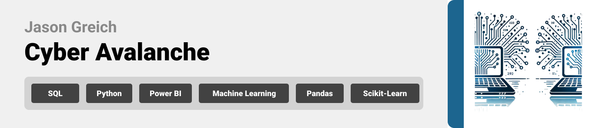

<br><br>

<!-- project philosophy -->


> A full-stack data project for analyzing cyber attacks on individuals and companies, combining multiple datasets in a MySQL data warehouse, cleaning and analysis in Python, visualization in Power BI, and using a Random Forest algorithm to predict anomaly score classes.
>
> Cyber Avalanche aims to streamline the process of cyber attack analysis by providing a comprehensive data pipeline from ingestion to visualization and machine learning. The goal is to identify and predict potential anomalies in cyber attack patterns to better understand vulnerabilities and enhance security


### User Stories
- As a user, I want to view visualizations of cyber attack data in Power BI dashboards, so I can quickly gain insights into where and how attacks are happening.

- As a business executive, I want to assess the impact of cyber attacks through detailed reports, so I can make informed decisions about security investments and risk management.

- As a data engineer, I want to ensure the data is processed and updated efficiently from multiple sources, so I can keep the system reliable for continuous analysis.
<br><br>


<!-- Tech stack -->


### Cyber Avalanche is built using the following technologies:

- This project uses [MySQL](https://www.mysql.com/) as the primary data warehouse for storing and managing multiple datasets on cyber attacks targeting individuals and companies.

- For data cleaning and preprocessing, [Python](https://www.python.org/) is used along with libraries like Pandas and NumPy, which provide powerful tools for transforming, filtering, and analyzing the data.

- To create visualizations that help identify trends and anomalies in cyber attacks, [Power BI](https://powerbi.microsoft.com/) is utilized for interactive dashboards and reports.

- For machine learning and anomaly detection, a [Random Forest algorithm](https://scikit-learn.org/stable/modules/generated/sklearn.ensemble.RandomForestClassifier.html) from Scikit-learn is used to predict anomaly score classes, helping organizations mitigate cyber threats.

- The project adheres to best practices in data engineering, ensuring smooth data ingestion, transformation, and presentation across all stages of the pipeline.

<br><br>

<!-- Database Design -->


###  Architecting Data Excellence: Innovative Data Warehouse Design Strategies:

- Below is the ER Diagram that demonstrates the database structure for Cyber Avalanche, showcasing the relationships between the different datasets on cyber attacks targeting individuals and companies.


<br><br>


<!-- Implementation -->


### User Screens (Mobile)
| Login screen  | Register screen | Landing screen | Loading screen |
| ---| ---| ---| ---|
|  |  |  |  |
| Home screen  | Menu Screen | Order Screen | Checkout Screen |
|  |  |  |  |

### Admin Screens (Web)
| Login screen  | Register screen |  Landing screen |
| ---| ---| ---|
|  |  |  |
| Home screen  | Menu Screen | Order Screen |
|  |  |  |

<br><br>


<!-- Prompt Engineering -->


###  Mastering AI Interaction: Unveiling the Power of Prompt Engineering:

- This project uses advanced prompt engineering techniques to optimize the interaction with natural language processing models. By skillfully crafting input instructions, we tailor the behavior of the models to achieve precise and efficient language understanding and generation for various tasks and preferences.

<br><br>


<!-- Unit Testing -->


###  Precision in Development: Harnessing the Power of Unit Testing:

- This project employs rigorous unit testing methodologies to ensure the reliability and accuracy of code components. By systematically evaluating individual units of the software, we guarantee a robust foundation, identifying and addressing potential issues early in the development process.

<br><br>


<!-- How to run -->


> To set up Coffee Express locally, follow these steps:

### Prerequisites

This is an example of how to list things you need to use the software and how to install them.
* npm
  ```sh
  npm install npm@latest -g
  ```

### Installation

_Below is an example of how you can instruct your audience on installing and setting up your app. This template doesn't rely on any external dependencies or services._

1. Get a free API Key at [example](https://example.com)
2. Clone the repo
   git clone [github](https://github.com/your_username_/Project-Name.git)
3. Install NPM packages
   ```sh
   npm install
   ```
4. Enter your API in `config.js`
   ```js
   const API_KEY = 'ENTER YOUR API';
   ```

Now, you should be able to run Coffee Express locally and explore its features.